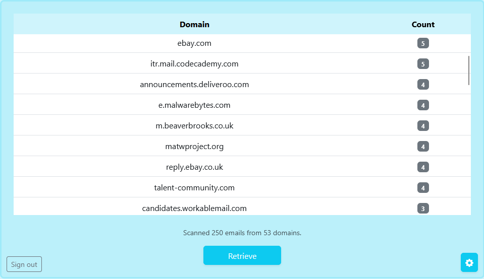

# Email-Analyser

> **Status: in development.** The core sign-in and scanning flow works end to end; see the [roadmap](#roadmap).

Who actually fills your inbox? Email-Analyser signs in to your Gmail account with Google OAuth2 (read-only), scans your most recent inbox messages and ranks the sender domains by how many emails each one sent you.



## Features

- **Google sign-in with read-only access.** Uses the `gmail.readonly` scope, so the app can never send, delete or change email.
- **Sender domain ranking.** Counts emails per domain and sorts them, most frequent first.
- **Adjustable scan size.** Choose how many recent inbox emails to scan (1–500) from the settings panel.
- **Fast scanning.** Fetches only the `From` header of each message, 10 requests at a time.

## Tech stack

Node.js, Express 5, express-session, Google APIs Node.js client (Gmail API v1, OAuth2), Bootstrap 5, `node:test`.

## Getting started

### 1. Set up Google credentials

1. In [Google Cloud Console](https://console.cloud.google.com/), create a project and enable the **Gmail API**.
2. Configure the **OAuth consent screen** (External, testing mode) and add your own Google account as a test user.
3. Under **Credentials**, create an **OAuth client ID** of type **Web application**.
4. Add this **Authorised redirect URI**: `http://localhost:3000/auth/google/callback`

### 2. Configure and run

```bash
git clone <this-repo-url>
cd email-analyser
npm install
cp .env.example .env   # then fill in your client ID, secret and a session secret
npm start
```

Open <http://localhost:3000>, click **Sign in with Google**, then **Retrieve**.

| Command       | What it does                          |
| ------------- | ------------------------------------- |
| `npm start`   | Starts the server                     |
| `npm run dev` | Starts the server and restarts on save |
| `npm test`    | Runs the unit tests                   |

## How it works

1. `/login` redirects to Google's consent screen with a random `state` value stored in the session.
2. Google redirects back to `/auth/google/callback`. The server checks `state` matches, exchanges the code for tokens, and keeps the tokens in the server-side session only (they never reach the browser).
3. The browser calls `/data?max=N`. The server lists up to N inbox message IDs (following page tokens), fetches each message's `From` header in parallel, extracts the domain and returns the counts as JSON.

```
public/        Front end (only this folder is served)
  index.html
  client.js
src/
  index.js     Express server: sessions, OAuth routes, API
  gmail.js     Gmail scanning, domain parsing and counting
test/
  gmail.test.js
```

## Security notes

- Read-only Gmail scope; access tokens are held server-side in the session and expire after an hour.
- OAuth `state` parameter protects the sign-in flow against CSRF, and the session ID is regenerated after login.
- A new OAuth client is created per request, so one user's credentials are never shared with another.
- The server refuses to start without its secrets instead of falling back to defaults.
- Secrets live in `.env`, which is git-ignored. `.env.example` lists what's needed.

## Roadmap

- [ ] Charts of the top domains
- [ ] Date range filter (e.g. last 30 days)
- [ ] Export results to CSV
- [ ] Persistent session store (the default in-memory store is for local use only)
- [ ] Deploy a hosted demo
